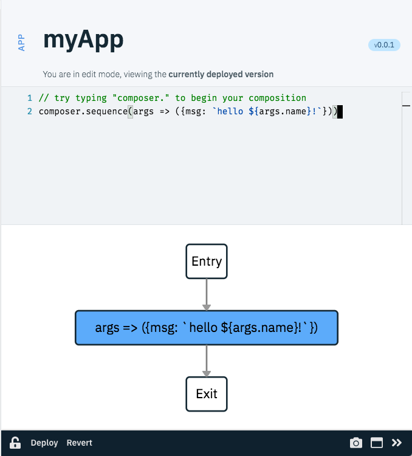
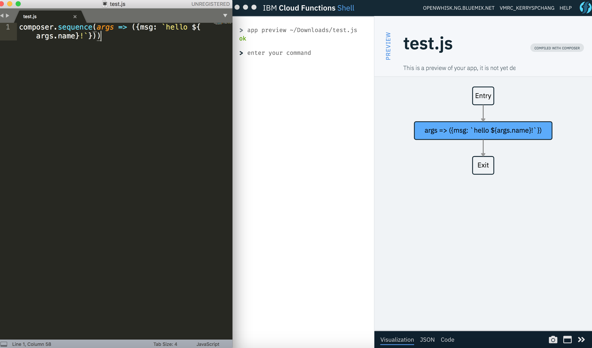
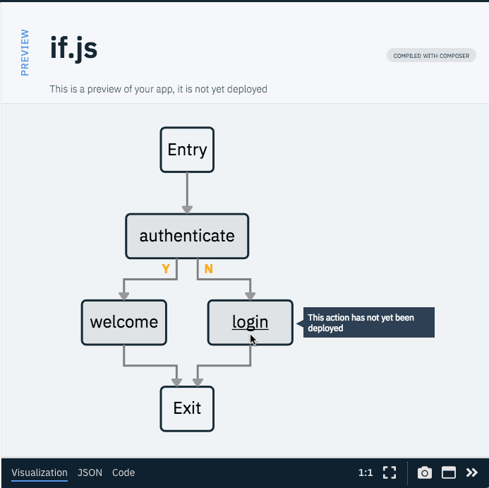
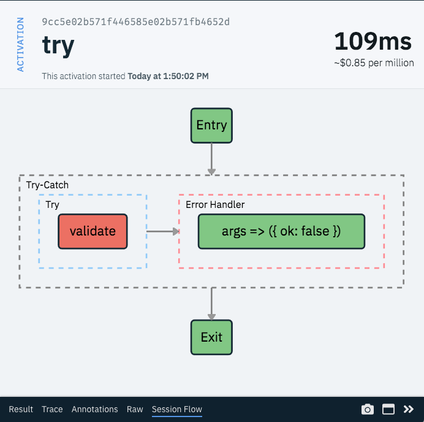
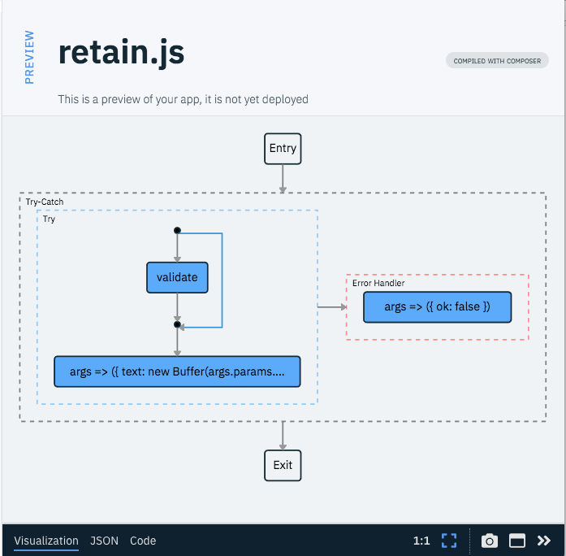

# Introduction to Serverless Composition

Composer is an [IBM Cloud Functions](https://ibm.biz/openwhisk)
programming model for composing individual functions into larger
applications. Compositions, informally named _apps_, run in the cloud
using automatically managed compute and memory resources. Composer is
an extension of the function-as-a-service computing model, and enables
stateful computation, control flow, and rich patterns of data flow.

Programming for the serverless cloud is a uniquely new experience. For
this reason, we have developed a unified environment that offers the
benefits and familiarity of a command line interface, with
visualization and a graphical interface to assist in certain
tasks. This environment is offered through a new tool called 
[IBM Cloud Shell](https://github.com/ibm-functions/shell), or just _Shell_.

## Shell quick start

Shell is a cross-platform desktop application powered by [Electron](https://electronjs.org/). 

### Before you run your first app

You must have a valid IBM Cloud (i.e., Bluemix)
[account](https://ibm.biz/openwhisk), or deploy [Apache
OpenWhisk](https://github.com/apache/incubator-openwhisk)
locally. This is needed because Composer builds on and extends Apache
OpenWhisk, which powers IBM Cloud Functions.

* Existing `wsk` CLI users: You can go directly to [Installing Shell](#installing-shell). 

* _New users using composer with IBM Cloud Functions:_ you need an IBM Cloud
[account](https://ibm.biz/openwhisk), and the [IBM Cloud CLI](https://console.bluemix.net/docs/cli/reference/bluemix_cli/download_cli.html#download_install) (`bx`). You will also need to install the Cloud Function Plugin for bx: 

  ``` 
  $ bx plugin install Cloud-Functions -r bluemix
  ```

  After installing `bx` and the Cloud Function plugin, use `bx login` to generate a access token for Cloud Function. 

  ``` 
  $ bx login -a api.ng.bluemix.net -o yourBluemixOrg -s yourBluemixSpace
  ```

  Run a test to generate credentials and verify your setup. Here, we perform a blocking (synchronous) invocation of echo, passing it "hello" as an argument. If you see the return message, you are good to go.  
  ```
  $ bx wsk action invoke /whisk.system/utils/echo -p message hello --result
  {
    "message": "hello"      
  }
  ```

* _New users using composer with Apache OpenWhisk:_  you need a valid `$HOME/.wskprops` file and a locally deployed OpenWhisk instance.


### Installing Shell

Shell is currently distributed through the [Node
package manager](https://www.npmjs.com/package/@ibm-functions/shell).

```
$ npm install -g @ibm-functions/shell
```

We roll out frequent updates and bug fixes. You can check for new
releases via `fsh version -u`.

```
$ fsh version -u
You are currently on version x.y.z
Checking for updates... you are up to date!
```

We recommend updating the shell via the same `npm install` command
shown earlier.  Consult the [troubleshooting
guide](https://github.com/ibm-functions/shell/blob/master/npm.md) if
your installation fails.


### Starting Shell 

```
$ fsh shell
```

You will see a window popping up. Welcome to Shell!

_Tip:_ If you are using Mac, you can keep Shell in the dock by right-clicking on the blue Cloud Function Shell icon and choose `Options > Keep in Dock`. Next time you can click on the icon in the dock to launch Shell. 


## Your first app

Compositions are described using a [Node.js library](../../README.md)
which offers an SDK for describing control structures. We call these
_combinators_.  The simplest combinator constructs a sequence. For example, here is
a snippet for your first app: 

```javascript
composer.sequence(args => ({msg: `hello ${args.name}!`}))
```

The code describes a sequence app with just one function that is inlined for convenience. 

There are two ways to deploy a composition code snippet. One is using Shell to write the code and deploy it. The other is using any editor to write this code, save it as a local file, and deploy the file using a Shell command. We describe both here.  


### Write an app in Shell

In Shell, enter 

```bash
# enter in Shell
> compose myApp 
```

where `myApp` is the name of the app in the cloud. This command opens a built-in editor in a sidecar for writing code. Copy the `composer.sequence` code above and paste it into the editor. Hit "Deploy" at the bottom stripe to deploy it. After the app is successfully deployed, Shell will show a flow graph that represents the textual composition code at the bottom of the editor as a verification. 

_Tip:_ Enter `edit myApp` to edit `myApp` after it is deployed. 

||
|:--:|
|Your first app, composed in Shell.|


### Write an app in an external editor

You may also use your favorite editor to compose apps. When finished, save your code to a file on your machine with the extension `.js`. To view your local composition javascript file as a graph, enter

```bash
# enter in Shell
> app preview path/to/file.js
```

Shell watches the file you are editing and automatically
updates the graph as you compose. You can use this active preview mode
to incrementally build your application, sanity checking your control
flow as you go. 

||
|:--:|
|Writing an app in my own editor, and previewing the code as a graph in Shell.|


To deploy a local composition file to the cloud, enter this command:
```bash
# enter in Shell
> app create myApp path/to/file.js
```

Again, `myApp` is the name of the app in the cloud. 

_Tip_: If you have an action already named `myApp`, the shell will report a name conflict. Use a different name for your app, or use `app update` if you want to update an existing app. Apps are stored as OpenWhisk actions, and hence the naming restrictions for OpenWhisk apply.


## Running your first app

Run your first app using this command: 
 
```bash
# enter in Shell
> app invoke myApp -p name composer
```

You will see the result in the sidecar. Click on different buttons in the sidecar bottom stripe to explore different views. 

_Tip #1:_ Enter `app invoke --help` to view the usage of the `app invoke` command. You can access the usage information of other commands in Shell in the same way using `--help`. 

_Tip #2:_ Enter `session list` to view a list of previous app executions. 


## Composing OpenWhisk actions

Combinators accept either inline Node.js functions or actions by name.
For the latter, you may use a fully qualified name of an action (i.e.,
`/namespace[/package]/action`) or its short name. Here is an example
using the `date` action from the `/whisk.system/utils` package.

```javascript
composer.sequence('/whisk.system/utils/date')
```

A composition which refers to actions by name will not run correctly
if there are missing referenced entities. The `app preview` will
highlight any missing entities. As an example, preview the built-in
[`@demos/if.js`](https://github.com/ibm-functions/shell/blob/master/app/demos/if.js)
composition, which is [described in the next
section](#if-combinator). The control flow graph should be
self-explanatory. An action is gray when it is not yet deployed, and
blue otherwise.

```bash
# enter in Shell
> app preview @demos/if.js  
```

||
|:--:|
|Control flow graph for `if` combinator. An action that is not yet deployed is gray, and blue otherwise.|

_Tip:_ Shell supports `wsk` CLI commands for deploying OpenWhisk actions. We will explain how to do so next. You can also read more about using `wsk` commands in Shell [here](https://github.com/ibm-functions/shell/blob/master/fsh.md). 


### Composing inline functions vs. OpenWhisk actions

The main difference between using an inline function verses a OpenWhisk action in a composition is that an inline function does not generate an activation like an OpenWhisk action. [Activations](https://github.com/apache/incubator-openwhisk/blob/master/docs/reference.md) record runtime data like the execution time and output. They are useful for debugging.

When making a real app, we encourage you to create the main components as OpenWhisk actions, as OpenWhisk actions can be reused by different apps and are easier to debug. Inline functions can be used as a convenient way to connect different components together (such as renaming input and output, generating an error message) and are better kept short and simple. 


## Compositions by example

You now have the basic tools to build a serverless composition, invoke
it, and inspect its execution and result. Currently, Composer offers [13 different combinators](../../README.md#combinators) to support conditions, iterations, error handling, variable declarations and other common programming constructs for building various types of apps. 

This section will introduce you to some combinators for creating richer control and data flow, while other combinators are covered in the [reference manual](../../README.md). All javascript code described below is [bundled in Shell](https://github.com/ibm-functions/shell/blob/master/app/demos) and can be accessed within Shell using the prefix `@demos/`. 


### `if` combinator

An `if` combinator allows you to describe a conditional flow with a
`then` and optional `else` branch. This is convenient for
short-circuiting a sequence for example, or taking data-dependent
paths in the control flow.

Here is a short example. Say you have a function `welcome` which generates an HTML page.

```javascript
// @demos/welcome.js
let welcome = args => ({ html: `<html><body>welcome ${args.name}!</body></html>` })
```

In order to use this function as part of an authenticated API, we can
modify the function itself to introduce authentication middleware. Or,
we can compose it with an authentication function.

```javascript
// @demos/authenticate.js
let authenticate = args => ({ value: args.token === "secret" })
```

For illustration purposes, `authenticate` is a simple token based
checker. If the token equals the secret value, return `true`, and
`false` otherwise. In a real scenario, this function may delegate to a
third party service or identity provider.

Let's add a third function, this one to deal with the
non-authenticated case and return a different HTML page, perhaps
informing the client to try again with the proper secret.

```javascript
// @demos/login.js
let login = args => ({ html: `<html><body>please say the magic word.</body></html>` })
```

The `if` combinator composes these three functions as you might
expect.

```javascript
// @demos/if.js
composer.if(
  /* cond */ 'authenticate',
  /* then */ 'welcome',
  /* else */ 'login')
```

Now, enter the following in Shell to deploy and run the app.

```bash
# enter in Shell
# create required actions
> action create authenticate @demos/authenticate.js
> action create welcome @demos/welcome.js
> action create login @demos/login.js

# create app
> app create if @demos/if.js

# invoke app, with no secret parameter
> app invoke if
{
  html: "<html><body>please say the magic word.</body></html>"
}

# now invoke with secret parameter
> app invoke if -p token secret -p name if-combinator
{
  html: "<html><body>welcome if-combinator!</body></html>"
}
```

_Tip:_ You can see the output data of an action node in the `Session Flow` graph by clicking on the node. This will bring you to the corresponding activation. _Note:_ An inline function node is not clickable as it does not generate an activation. 

Each of the activations will have a different session id, which are reported by listing the available sessions.

```bash
# enter in Shell
> session list 
```

Clicking on a session id from the list will open that session in the sidecar. 

_Tip:_ Clicking on a session id invokes the command `session get sessionId` to view the session info in the sidecar. 


### `try` combinator

Another common composition pattern is for error handling and
recovery. Composer offers a `try` combinator that is analogous to
`try-catch`.

A example to illustrate using `try` is a schema or data validation
action. Let `validate` be an action which checks if a string is base64
encoded, and which throws an exception if the input is not valid. A
`try` combinator allows an error handler to rewrite the result, as
one example, to suite the particular usage scenario in the app.

```javascript
// @demos/try.js
composer.try(
  /* try   */ 'validate',
  /* catch */ args => ({ ok: false }))
```

The `validate` action is available as [`@demos/validate.js`](https://github.com/ibm-functions/shell/blob/master/app/demos/validate.js) and the
composition as [`@demos/try.js`](https://github.com/ibm-functions/shell/blob/master/app/demos/try.js) for your convenience.

```bash
# enter in Shell
# create validate action
> action create validate @demos/validate.js

# create app
> app create try @demos/try.js

# invoke app with valid parameter
> app invoke try -p str aGVsbG8gdHJ5IQ==
{
  ok: true
}

# and now for the failing case
> app invoke try -p str bogus
{
  ok: false
}
```

It is worth looking at the session flow of the second app invoke where
the catch handler is invoked.

```bash
# enter in Shell
> session get --last try
```

||
|:--:|
|Session execution for `try` where the handler is invoked.|


Notice that the `validate` action failed, as expected. This is
visually recognized by the red-colored action, and the hover text which
shows the action result containing the error. The app result is
successful however, as the handler rewrites the exception into a
different result.

## Nesting and forwarding

An important property of the combinators is that they nest. This
encourages modularity and composition reuse. The example that follows
illustrates both composition nesting, and data forwarding. The example
builds on the `try` app described in the previous section. Here, after
the validate task, we extend the composition with a base64 decoder to
render the input `str` in plain text.

Recall that the result of the `validate` task is `{ok: true}`,
not the `str` argument that it processed. So we need a way to forward
`str` around this action. In other words, we _retain_ the input
arguments to `validate`, and pass them to the next action in the
sequence.  Composer offers a combinator for just this purpose. Below
is the composition showing the inner sequence with the data forwarding
combinator `retain`.

```javascript
// @demos/retain.js
composer.try(
  composer.sequence(
    composer.retain('validate'),
    args => ({ text: new Buffer(args.params.str, 'base64').toString() })),
  args => ({ ok: false }))
```

The `retain` combinator produces an output with two fields: `params`
and `result`. The former is the input parameter of the
composition. The latter is the output of `validate`. The control and
dataflow for this composition is shown below, and is available in the
shell as
[`@demos/retain.js`](https://github.com/ibm-functions/shell/blob/master/app/demos/retain.js).

```bash
# enter in Shell
> app preview @demos/retain.js
```

||
|:--:|
|Control flow graph showing the `retain` combinator and the implied dataflow around `validate`.|

The app will now produce the decoded text as its final output.

```bash
# enter in Shell
# create app
> app create retain @demos/retain.js

# invoke app with valid parameter
> app invoke retain -p str aGVsbG8gdHJ5IQ==
{
  text: "hello try!"
}

# and now for the failing case
> app invoke retain -p str bogus
{
  ok: false
}
```

## Variables and scoping

The composer allows you to introduce variables within a composition,
and to limit their scope. This is useful when you have to introduce
service keys and credentials for example. A scoped variable is defined
using `let`. The example below illustrates how you might introduce a
"secret" for a specific task without its value escaping to other
compositions or functions.

```javascript
// @demos/let.js
composer.sequence(
  composer.let({secret: 42},
    composer.task(_ => ({ ok: secret === 42 }))),
  composer.task(_ => ({ ok: (typeof secret === 'undefined') })))
```

The composition will execute successfully only if `secret` is not
leaked to the final task in the composition, while the value is
available inside the task nested within the `let`.

```bash
# enter in Shell
> app create let @demos/let.js
> app invoke let
{
  ok: true
}
```

## Other combinators

The examples shown here illustrate the more common combinators you
may use to create serverless compositions. There are more combinators
available in the Composer library. Refer to the [Composer reference
manual](../../README.md) for more details.

## Next step

Try the second tutorial, [building a translation chatbot](../translateBot/README.md). 

