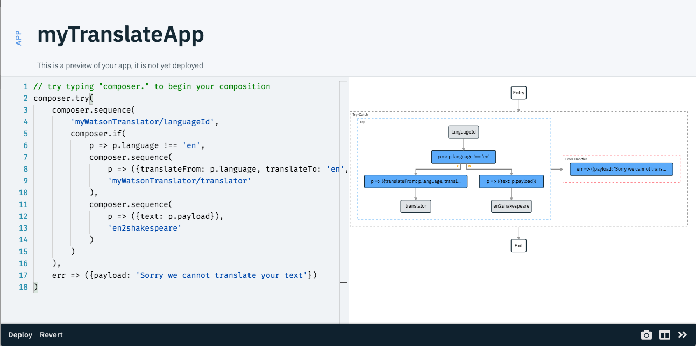
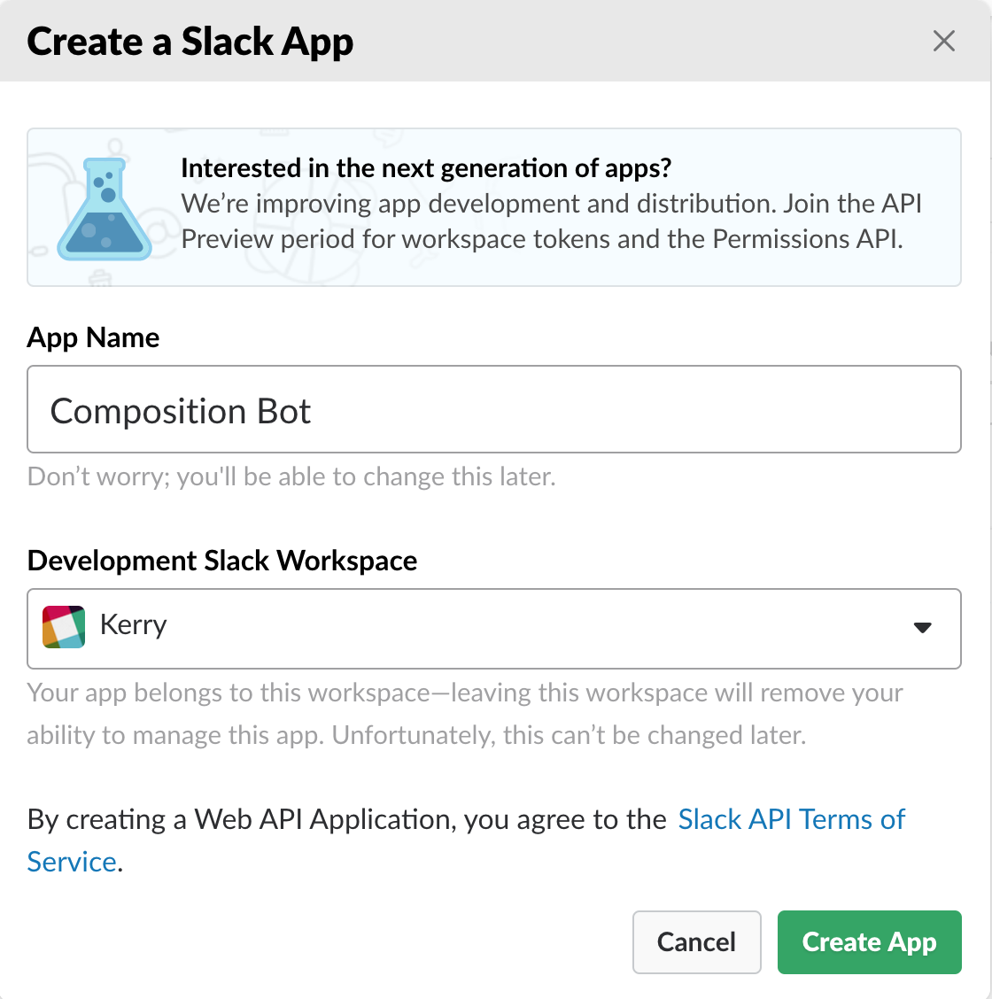
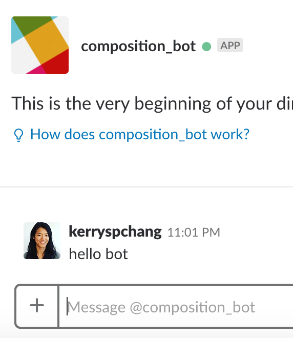
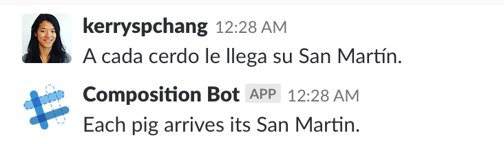

# Building a Translation Slack Bot with Serverless Composition 

Let's do something fun with Composition: We will build a serverless chatbot that translates the user's message using the IBM Watson Language Translation services. This tutorial assumes you have finished the [introduction](../introduction/README.md), which describes the basics about Composition and the instructions to setup the development environment ([Shell](https://github.com/ibm-functions/shell)). 

Here's what our chatbot does. 
* First, it identifies the language of the user's message. 
* If the language is not English, it translates the message to English. 
* If the language is already English, just to make things more fun, it translates the message to "Shakespeare English". 
* If the message is not translatable (such as if the message is a number), it returns a error message. 

Let's get started. 

## Composing the app

Here is our composition code, using the [Composer NodeJs library](../../README.md). 
```javascript
composer.try(
    composer.sequence(
        'myWatsonTranslator/languageId',
        composer.if(
            p => p.language !== 'en',
            composer.sequence(
                p => ({translateFrom: p.language, translateTo: 'en', payload: p.payload}),
                'myWatsonTranslator/translator'
            ),
            composer.sequence(
                p => ({text: p.payload}),
                'en2shakespeare'
            )
        )
    ),
    err => ({payload: 'Sorry we cannot translate your text'})
)
```

In Shell, enter

```bash
# in Shell
> compose myTranslateApp
```

Copy and paste the javascript code above to the editor, and hit "Deploy". You will see a graph that represents your the textual composition code when the app is successfully deployed. 

||
|:--:|
|Your translate app. _Tip:_ You can click on the "full width" icon at the bottom right of the sidecar to expand the sidecar to full width.|

This app first calls an OpenWhisk action `myWatsonTranslator/languageId` to identify the language type. Then it uses the `if` combinator to say if the identified language is not English, call `myWatsonTranslator/translator` to translate the input message (in `payload`) to English. Otherwise, call `en2shakespeare` to translate English to Shakespeare English. This sequence is wrapped in a `try` combinator to catch any error in the process. Short inline functions are used to quickly check a property value, rename data based on the requirement of an action, and generate an error message. 

All action nodes in the graph are gray at this moment because we don't have those actions deployed yet. 


## Using IBM Watson Language Translation service 
We use a built-in OpenWhisk package for using IBM Watson Language Translation service. To do so you need to have a valid [IBM Cloud account](https://www.ibm.com/cloud/) and a Language Translation service instance under your namespace. The service offers a lite plan that is free of charge. Here we will quickly walk through how to get the service credential and set up the Watson Translation OpenWhisk package. 

If you already have the Watson Translation OpenWhisk package setup, change `myWatsonTranslator` in the composition code to the name of your translation package and redeploy the app. If you see `languageId` and `translator` in the graph become blue, you can move directly to the [next section](#creating-en2shakespeare). 

_Tip:_ You can edit an exiting app using the command `edit appName`.

Follow the steps here to get your Language Translation service credential: 
1. Go to your [IBM Cloud dashboard](https://console.bluemix.net/dashboard/apps)
2. If you see a `Language Translator` service offering in your list, click on it and go to Step 5. Otherwise, click on the `Create resource` button at the upper right. 
3. Search for "Language Translation" and click on it. 
4. Select the free lite plan, then click "Create" at the bottom to create the service instance.
5. You will be at the Language Translation service homepage. Click on the "Service credentials" tab at the left pane. 
6. Choose a service credential that you'd like to use form the list. If you don't see any credentials, click "New credential" then "Add" to add a new credential. 
7. There is a "View credentials" option that you can click to expand. You'll see a `username` and a `password`. We will use them to set up the Watson Translation OpenWhisk package. 

Now go back to Shell and enter the following command to set up the translation package with your credential: 

```bash
# in Shell
> wsk package bind /whisk.system/watson-translator myWatsonTranslator -p username MYUSERNAME -p password MYPASSWORD 
```

Replace `MYUSERNAME` and `MYPASSWORD` with your username and password. This command creates a package under your namespace called `myWatsonTranslator` from the built-in `whisk.system/watson-translator` package, and binds your service credentials to it. You can now try to invoke an action in this package to test if things are set up correctly:

```bash
# in Shell
> action invoke myWatsonTranslator/languageId -p payload "bonjour"
{
    "language": "fr",
    "payload": "bonjour",
    "confidence": 0.799347
}
```

_Tip:_ You can read more about using OpenWhisk packages [here](https://github.com/apache/incubator-openwhisk/blob/master/docs/packages.md).

## Creating en2shakespeare

`en2shakespeare` is a typical example of turning a web API service into an OpenWhisk action (cloud function). It uses the `request` npm module to send an http request. Here's the code:

```javascript
var request = require("request");
function main(params) {
    var options = {
        url: "http://api.funtranslations.com/translate/shakespeare.json",
        qs: {
            text: params.text,
            api_key: params.apiKey
        },
        json: true
    };    
    return new Promise(function(resolve, reject) {
        request(options, function(err, resp) {
            if (err) {
                reject({error: err})
            }
            resolve({
                payload: resp.body.contents.translated
            });
        });
    });
};
```

In Shell, enter

``` bash
# in Shell
> new en2shakespeare 
```

Copy and paste the above javascript code into the editor and hit `Deploy` to deploy the action. 

Now, enter `app get myTranslateApp` in Shell and you should see all the nodes blue. We can now run the app.

_Note:_ `en2shakespeare` uses an API from [Fun Translations](http://funtranslations.com/). The API allows some free calls without providing an API key. You can subscribe this API with Fun Translations and change `params.apiKey` in the code to be your key. 

_Tip #1:_ OpenWhisk Node.js runtime provides [several built-in npm modules](https://github.com/apache/incubator-openwhisk/blob/master/docs/reference.md#nodejs-version-6-environment), including `request` that we use here. You can also create a [zip action](https://github.com/apache/incubator-openwhisk/blob/master/docs/actions.md#packaging-an-action-as-a-nodejs-module) that uses any custom modules you'd like.

_Tip #2:_ You can edit an existing action using `edit actionName`

## Running the app

```bash
# enter in Shell
> app invoke myTranslateApp -p payload "Mieux vaut prévenir que guérir"
{    
    "payload": "Prevention is better than cure"
}
> app invoke myTranslateApp -p payload "hello world"
{
    "payload": "Valorous morrow to thee,  sir ordinary"
}
> app invoke myTranslateApp -p payload "3.14159"
{
    "payload": "Sorry we cannot translate your text"
}
```

Checkout the `Session Flow` and `Trace` tab of a session to look at the execution path and trace of your app. You can use `session list` to see a list of recent sessions, and click on a session to view its detail in the sidecar. 

## Connecting the app to Slack 

Now we have the main functionality of the bot programmed, we need to connect it to Slack. To create a new Slack bot, you need to go to your [Slack API app page](https://api.slack.com/apps), login and choose `Create New App`. You will be prompted to give your app a name and select a development workspace. Here I call my app `Composition Bot` and select my personal workspace. 

||
|:--:|
|Create a new Slack app for our bot|

At your Slack app's main page, follow the steps to setup the chatbot: 

1. Go to `Features > Bot Users` and `Add a Bot User`. I have both display name and default username be `composition_bot`. Turn on `Always Show My Bot as Online`. Press `Add Bot User` to add the bot. 
2. Go to `Settings > Install App` and click `Install App to Workspace`. Authorize Slack to add the bot user. 
3. GO to `Features > Event subscriptions`, turn it on, go to `Subscribe to Bot Events` and add the `message.im` bot user event. This event is fired when our bot receives a direct message. Scroll to the top of the page. You'll see an empty `Request URL` text box. 

Let's go back to Shell now to create a new app called `slackTranslationBot`

```bash
# in Shell
> compose slackTranslationBot
```

Paste the following code to the editor, and hit Deploy.

```javascript
composer.sequence(p => p)
```

`slackTranslationBot` currently only has an echo function that will return whatever the input is. Now, let's create a URL endpoint for triggering `slackTranslationBot`. 

```bash
# in Shell
> webbify slackTranslationBot
https://openwhisk.ng.bluemix.net/xxxxx....
```

The `webbify` command creates a URL for invoking a cloud function or composition. Copy of that URL, go back to the web browser and paste it to the `Request URL` text box in our Slack app's `Event subscriptions` page. Hit `Save Changes` at the bottom of the page. Now, try sending a direct message to our `composition_bot`.

||
|:--:|
|Send a test message "hello bot" to the slack bot|

In Shell, enter `session get --last` to view the most recent session that was from `slackTranslationBot` as it just got triggered. View the data returned by Slack. According to Slack's [documentations](https://api.slack.com/events/message), the message is stored in `event.text`. Also, if a message is generated by the bot itself, there'll be a `event.subtype` that has the value `"bot_message"`. We do not want our bot to reply to itself, so we will add a condition in the composition code to handle that later. 

The last piece we need is to create an action that can send a message back to our bot. Go to `Features > Incoming Webhooks`in the Slack app page. Turn the feature on, and add a new webhook that enables our app to post to `@composition_bot`. We can post a message by making a HTTP POST request with data `{"text": "our message"}` to the webhook. Let's create an action to do that.

```bash
# in Shell
> new sendSlackMsg
```

Copy the below JavaScript code and paste it in the editor. Remember to replace the value of `url` to be your webhook URL. Hit `Deploy` when you're done. 

```javascript
var request = require('request');
function main(arg){
    return new Promise((resolve, reject) => {
        request.post({
            headers: {'content-type' : 'application/json'},
            url: 'http://xxxxx',    // replace this with your webhook url
            body: JSON.stringify({text: arg.text})
        }, function(error, response, body){
            if(error){
                reject({success: false, input: arg.text, error: error});
            }
            resolve({success: true, input: arg.text, result: response});
        });
    }); 
}
```

Now let's edit the `slackTranslationBot` app. 

```bash
# in Shell
> edit slackTranslationBot
```

Copy and paste this code to the editor, and redeploy `slackTranslationBot`.

```javascript
composer.if(
    p => p.event.subtype !== 'bot_message', // ignore the messages sent by the bot itself
    composer.sequence(
        p => ({payload: p.event.text}),   // rename data for the next action
        'myTranslateApp',           // do translation
        p => ({text: p.payload}),   // rename data for the next action
        'sendSlackMsg'              // send a message back
    )
) 
```

Here we reuse `myTranslateApp`, and use some inline functions to rename the data for Slack. You can imagine reusing `myTranslateApp` again if we want to build the same bot for other messaging platforms like Facebook. 

## Testing the Slack Bot 

Let's test it by sending another test message to our slack bot. 

||
|:--:|
|Now we have a translation Slack bot|

Congratulations! You now have a Slack bot that can translate the user's message. The bot is completely serverless, meaning that you never pay for an idle bot (only pay per use), and the bot scales automatically. 

You can use `session list --name slackTranslationBot` in Shell to look at your bot's execution history. 

